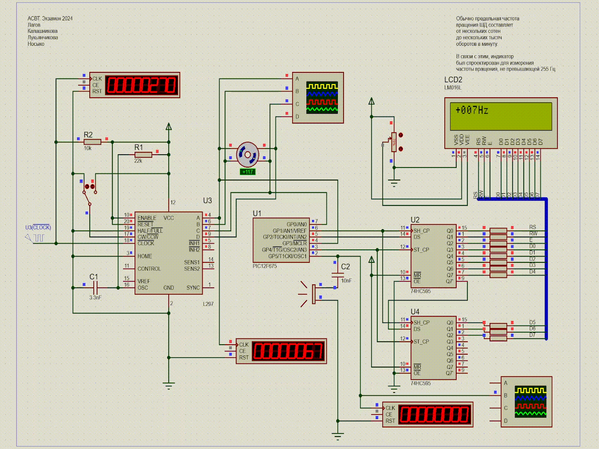

# Индикатор частоты и направления вращения ШД

Реализация индикатора частоты и направления вращения шагового двигателя. Точность измерения D = 1Hz. Вывод на LCD. Знак показывает направление. Звук при превышении порогового значения. Микроконтроллер PIC12F675.

